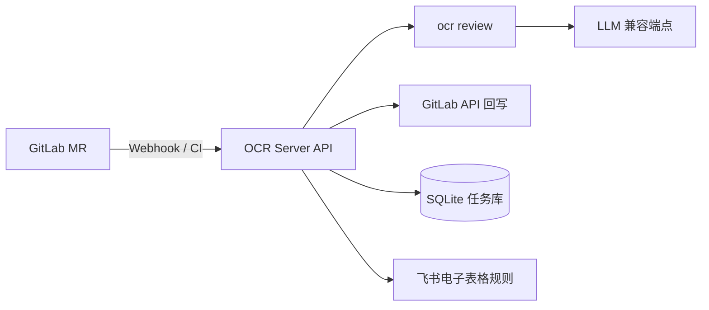

# OCR Server

OCR Server 是一个基于 FastAPI 的 GitLab Merge Request 自动代码审核服务。它封装阿里 [OpenCodeReview](https://github.com/alibaba/open-code-review)（`ocr`）CLI，用 LLM 对 MR 的代码改动做逐行审核，把问题以 **inline 评论 + 可一键采纳的修改建议**回写到 GitLab，并按严重程度自动卡点——命中 `critical/high` 即阻断合并。

除 Webhook 自动触发与 `/review` 同步调用外，还提供审核任务持久化、失败自动补发，以及从飞书电子表格同步团队自定义审核规则。

## 主要特性

- 🤖 **LLM 逐行审核** — 基于 `ocr` CLI 对 MR diff 逐文件分析，产出定位到行的问题评论与 `suggestion` 修改建议
- 🚦 **自动卡点** — 按 severity 判定，默认 `critical/high` 阻断合并，CI 通过 exit code 控制流水线
- 🔁 **双触发模式** — `/review` 同步接口 + GitLab Webhook 异步触发（任务排队，队列无上限）
- 💬 **GitLab 回写** — inline 评论 + 汇总 note，评论按严重程度排序，失败任务自动补发
- 🇨🇳 **中文输出** — 审核评论与问题描述默认中文（`REVIEW_LANGUAGE` 可切换）
- 🗃️ **持久化审计** — SQLite 记录任务状态与 webhook 事件，支持状态查询与重试
- 📋 **飞书规则同步** — 从飞书电子表格拉取团队自定义审核规则，每次审核前更新

## 适用场景

- GitLab Merge Request 自动审核，替代/辅助人工 review
- CI 中基于审核结果控制是否阻断合并
- 需要统一审核规则与审计记录的团队

## 运行架构



## 工作原理

1. **触发**：GitLab MR 经 Webhook（或 CI 调 `/review`）提交审核
2. **取 diff**：裸仓库缓存 + git worktree，增量 fetch（秒级，无需全量 clone）
3. **LLM 审核**：调用 `ocr review` 逐文件分析，返回结构化问题（path / 行号 / severity / 描述 / 修改建议）
4. **判定 + 回写**：按 severity 判定 approve/reject，回写 GitLab inline 评论（含 suggestion）与汇总 note
5. **卡点**：CI 依据返回结果 exit 0/1，放行或阻断合并

## 快速开始

### 1. 配置环境变量

```bash
cp .env.example .env
```

重点配置：

- `OCR_LLM_URL` / `OCR_LLM_TOKEN` / `OCR_LLM_MODEL`：ocr 连接的 LLM 端点（Anthropic 兼容）、令牌、模型名（如 `GLM-AUTO`）
- `GITLAB_URL` / `GITLAB_TOKEN`：GitLab 地址与 API Token（需 `api` 权限），用于 clone 与回写评论
- `WEBHOOK_SECRET`：GitLab Webhook Secret（可选但推荐）

完整字段见 `.env.example`。

### 2. 启动

```bash
docker-compose up -d --build
```

### 3. 健康检查

```bash
curl http://localhost:8000/health
# {"status":"ok","ocr_bin":"ocr","llm_url":"http://your-llm-endpoint"}
```

## 接口说明

| 方法 | 路径 | 说明 |
|---|---|---|
| `GET` | `/health` | 健康检查，返回 ocr 与 LLM 配置状态 |
| `POST` | `/review` | 同步审核（约 3-7 分钟），返回 approve / 评论等 |
| `POST` | `/gitlab/codeReview` | GitLab MR Webhook 入口 |
| `GET` | `/status/{task_id}` | 查询异步审核任务状态 |

`POST /review` 入参示例：

```json
{
  "project_id": "123",
  "project_url": "https://gitlab.example.com/group/project.git",
  "source_branch": "feature-x",
  "target_branch": "main",
  "mr_iid": "42",
  "commit_sha": ""
}
```

## GitLab Webhook 配置

在 GitLab 项目的 Webhook 页面：

- **URL**：`http://<server-host>:8000/gitlab/codeReview`
- **Secret Token**：与 `WEBHOOK_SECRET` 一致
- **触发事件**：Merge request events

> 要让审核结果真正阻断合并，还需在 GitLab 项目设置里开启 **Pipelines must succeed**。

## 文档

- [部署指南](docs/部署.md)
- [Docker 快速开始](docs/Docker部署.md)
- [功能文档](docs/功能文档/README.md)
- [设计文档](docs/设计文档/README.md)
- [进度文档](docs/进度文档.md)

## 本地开发

```bash
python -m venv .venv
.venv\Scripts\pip install -r requirements.txt
.venv\Scripts\python -m app.main
```

## 目录结构

```text
app/            # FastAPI 服务与审核逻辑
deploy/         # GitLab CI 模板与 systemd 部署文件
docs/           # 功能、设计、进度文档
scripts/        # ocr 安装脚本
Dockerfile      # 镜像构建
docker-compose.yml
.env.example
```

## 许可证

MIT License。
