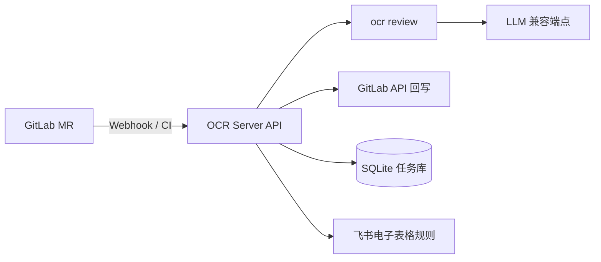

# OCR Server

一个基于 FastAPI 的 GitLab Merge Request 自动代码审核服务，封装 Alibaba OpenCodeReview（ocr）CLI，支持同步审核、GitLab Webhook 异步审核、GitLab 回写评论、审核记录持久化，以及飞书规则同步。

## 主要特性

- 支持 `POST /review` 同步审核接口，兼容现有调用方式
- 支持 `POST /gitlab/codeReview` GitLab Webhook 异步触发
- 支持 inline 评论、汇总 note、失败任务补发
- 支持 SQLite 持久化任务状态与 webhook 事件
- 支持按 severity 卡点，默认 `critical/high` 阻断合并
- 支持飞书电子表格同步自定义审核规则

## 适用场景

- GitLab Merge Request 自动审核
- CI 中基于审核结果控制是否阻断合并
- 需要统一审核规则和审计记录的团队

## 运行架构



## 快速开始

### 1. 配置环境变量

复制模板文件：

```bash
cp .env.example .env
```

重点配置以下地址与令牌：

- `OCR_LLM_URL`：ocr 使用的 LLM 端点，要求 Anthropic 兼容
- `OCR_LLM_TOKEN`：LLM 访问令牌
- `OCR_LLM_MODEL`：模型名，例如 `GLM-AUTO`
- `GITLAB_URL`：GitLab 地址，例如 `https://gitlab.example.com`
- `GITLAB_TOKEN`：GitLab API Token，用于回写评论
- `WEBHOOK_SECRET`：GitLab Webhook Secret，可选但推荐

`.env.example` 中已经提供了完整字段样例。

### 2. 使用 Docker Compose 启动

```bash
docker-compose up -d --build
```

### 3. 健康检查

```bash
curl http://localhost:8000/health
```

预期返回类似：

```json
{"status":"ok","ocr_bin":"ocr","llm_url":"http://your-llm-endpoint"}
```

## 接口说明

### `GET /health`

健康检查接口。

### `POST /review`

同步审核接口，入参示例：

```json
{
  "project_id": "123",
  "project_url": "https://gitlab.example.com/group/project.git",
  "source_branch": "feature-x",
  "target_branch": "main",
  "mr_iid": "42",
  "commit_sha": ""
}
```

### `POST /gitlab/codeReview`

GitLab Merge Request Webhook 接口。

### `GET /status/{task_id}`

查询异步审核任务状态。

## GitLab Webhook 配置

在项目的 GitLab 页面中配置 Webhook：

- URL：`http://<server-host>:8000/gitlab/codeReview`
- Secret Token：与 `WEBHOOK_SECRET` 保持一致
- 触发事件：Merge request events

## OCR 与 GitLab 地址配置

### OCR 地址

OCR Server 本身不直接调用 GitHub/GitLab 页面，而是通过 OCR CLI 连接你配置的 LLM 端点：

- `OCR_LLM_URL`：例如 `http://your-llm-endpoint.example.com:8320`

如果你使用的是内网 Anthropic 兼容服务，请确保该地址在部署环境中可达。

### GitLab 地址

- `GITLAB_URL`：例如 `https://gitlab.your-company.com`
- `GITLAB_TOKEN`：需要 `api` 权限

服务会基于该地址构造 clone URL，并在审核完成后回写讨论和评论。

## 文档

- [部署指南](docs/部署.md)
- [Docker 快速开始](docs/Docker部署.md)
- [功能文档](docs/功能文档/README.md)
- [设计文档](docs/设计文档/README.md)
- [进度文档](docs/进度文档.md)

## 本地开发

```bash
python -m venv .venv
.venv\Scripts\pip install -r requirements.txt
.venv\Scripts\python -m app.main
```

## 目录结构

```text
app/            # FastAPI 服务与审核逻辑
deploy/         # GitLab CI 与 systemd 部署文件
docs/           # 功能、设计、进度文档
Dockerfile      # 镜像构建
docker-compose.yml
.env.example
```

## 许可证

MIT License。
